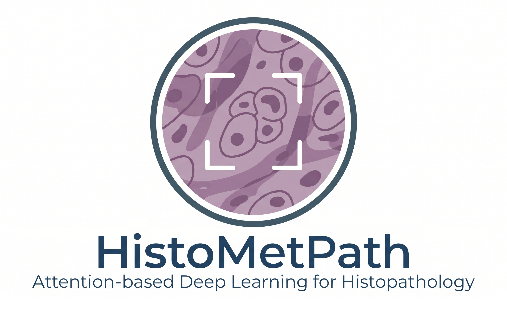

# HistoMetPath
Patch‑to‑WSI deep learning pipeline for breast cancer metastasis detection with attention‑based MIL and interpretability.

HistoMetPath is a complete, research-grade deep learning pipeline for breast cancer metastasis detection in histopathology images.
The project progresses from patch-level classification to slide-level multiple instance learning (MIL) with attention-based interpretability.

This repository reflects a fully implemented and evaluated system.

------------------------------------------------------------
HIGHLIGHTS
------------------------------------------------------------

- Patch-level CNN with stain normalization
- Clinically calibrated decision threshold
- Patch embedding extraction
- Pseudo-slide construction (PCAM-compatible)
- Mean and max pooling MIL baselines
- Attention-based MIL (Ilse et al., 2018)
- Visualization of attention on original RGB patches
- Fully reproducible, modular codebase

------------------------------------------------------------
SCIENTIFIC MOTIVATION
------------------------------------------------------------

Breast cancer metastasis is the primary cause of mortality in breast cancer patients.
Histopathological assessment of lymph nodes is time-consuming and subject to inter-observer variability.

Deep learning offers powerful tools for assisting pathologists, but practical deployment requires:
- Robustness to staining variability
- Sensitivity to sparse metastatic regions
- Slide-level decision making
- Interpretability of model predictions

HistoMetPath addresses these challenges through a principled patch-to-WSI modeling pipeline.

------------------------------------------------------------
DATASET
------------------------------------------------------------

This project uses the PatchCamelyon (PCAM) dataset.

Due to licensing restrictions, the dataset is NOT included in this repository.

Download PCAM from:
https://github.com/basveeling/pcam

Place the HDF5 files under:

data/pcam/

------------------------------------------------------------
PIPELINE OVERVIEW
------------------------------------------------------------

Phase 2.3 — Patch-Level Modeling
1. Patch-level CNN training with stain normalization
2. Validation-based threshold calibration
3. Clinically interpretable operating point selection

Phase 2.4 — Slide-Level Modeling (WSI / MIL)
4. Patch embedding extraction (512-D)
5. Pseudo-slide construction (synthetic MIL bags)
6. MIL baselines (mean and max pooling)
7. Attention-based MIL
8. Attention visualization on original RGB patches

------------------------------------------------------------
KEY RESULTS
------------------------------------------------------------

- Patch-level validation AUC ≈ 0.87
- Slide-level validation AUC ≈ 0.99 (attention MIL)
- Attention focuses on tumor-relevant histopathological regions
- Strong agreement between quantitative performance and qualitative interpretability

------------------------------------------------------------
REPOSITORY STRUCTURE
------------------------------------------------------------

datasets/        PCAM dataset loader
models/          CNN backbone and classifiers
training/        Training logic and metrics
analysis/        Thresholding, MIL, attention, visualization
configs/         Experiment configuration files

Generated artifacts (data, embeddings, logs, figures) are intentionally excluded from version control.

------------------------------------------------------------
REPRODUCIBILITY
------------------------------------------------------------

All experiments in this repository are fully reproducible.

- Raw data is not included due to licensing constraints.
- All intermediate artifacts (embeddings, logs, attention figures) are regenerated by running the provided scripts.
- Random seeds are fixed where applicable.
- Each stage of the pipeline is implemented as a standalone script under the analysis directory.

Reproduction steps:
1. Download the PCAM dataset
2. Train the patch-level model using main_train.py
3. Run analysis scripts in the documented order

------------------------------------------------------------
LICENSE
------------------------------------------------------------

MIT License (or update as needed)

  

<h2 align="center">Attention‑based Deep Learning for Histopathology</h2>

## Scientific Scope and Limitations

HistoMetPath currently operates on **synthetic pseudo-slides** derived from
PatchCamelyon (PCAM) patches.

Performance metrics should not be interpreted as native whole-slide image
or patient-level diagnostic performance.

Real WSI support requires explicit slide provenance and patient-level splits.
